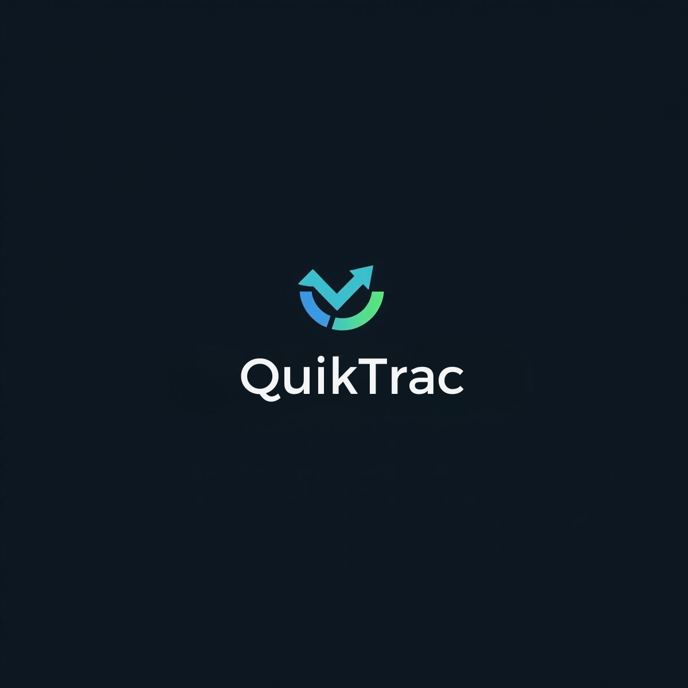

# Quicktrac

AI-powered recruiting workflow for faster, consistent shortlisting and multi-channel outreach. Integrates with Ceipal ATS, OpenAI, AWS S3/SES, WhatsApp (Meta/Twilio), and Voice AI (Vapi). Built with Next.js + TypeScript, shadcn/ui, and Tailwind CSS.

## Overview

- Import jobs and applicants from Ceipal on demand.
- Rank candidates via rubric-driven AI (skills, experience, education, role match, domain, recency, location).
- Store resumes in S3 (Mumbai) and parse to structured profiles for search.
- Search with filters, keyword, and semantic (pgvector).
- Outreach via WhatsApp, Email (SES), and Voice (Vapi) with audit trails.
- Generate job descriptions with OpenAI.
- Passive LinkedIn discovery using Google Custom Search + Playwright scraper.

See the full PRD: [tasks/prd-quicktrac.md](tasks/prd-quicktrac.md) and implementation plan: [tasks/tasks-prd-quicktrac.md](tasks/tasks-prd-quicktrac.md).

## Tech Stack

- Web: Next.js (App Router), TypeScript, shadcn/ui, Tailwind CSS
- AI: OpenAI (gpt-5 with fallback to GPT-4o)
- ATS: Ceipal API (jobs, applicants, details, optional write-back)
- Storage: AWS S3 (Mumbai) for resumes + parsed JSON
- DB: Postgres on Hetzner + pgvector; Prisma ORM
- Search: Hybrid (filters + keyword + semantic)
- Outreach: WhatsApp (Meta/Twilio), Email (AWS SES), Voice (Vapi)
- Scraping: Playwright + proxy rotation (LinkedIn public profiles)
- Observability: Structured logs, redacted prompts, audit trails
- Compliance: GDPR + India DPDP (consent, retention, DSAR)

## Getting Started

### Prerequisites

- Node.js LTS (>=18)
- pnpm or npm
- Access to: Ceipal API, OpenAI, AWS (S3 + SES in ap-south-1), WhatsApp provider(s), Vapi, Google Custom Search
- Postgres (Hetzner) with `pgvector` extension

### 1) Environment

Copy `.env.example` to `.env` and set values:

- Ceipal: `CEIPAL_EMAIL`, `CEIPAL_PASSWORD`, `CEIPAL_API_KEY`
- OpenAI: `OPENAI_API_KEY`
- Google CSE: `GOOGLE_API_KEY`, `GOOGLE_SEARCH_ENGINE_ID`, `GOOGLE_PUBLIC_URL`
- AWS: `AWS_REGION=ap-south-1`, `S3_BUCKET`, optional `AWS_ACCESS_KEY_ID`, `AWS_SECRET_ACCESS_KEY`
- Database: `DATABASE_URL` (Postgres on Hetzner)
- WhatsApp: `META_WA_PHONE_ID`, `META_WA_TOKEN` and/or `TWILIO_ACCOUNT_SID`, `TWILIO_AUTH_TOKEN`, `TWILIO_WA_FROM`
- Email (SES): `SES_REGION`, `SES_FROM_EMAIL`
- Voice (Vapi): `VAPI_API_KEY`, `VAPI_AGENT_ID`
- Scraper: `PROXY_URL` (if using proxies)

### 2) Install & Run

```bash
pnpm install # or npm install
pnpm dev     # or npm run dev
```

### 3) Quality Gates

```bash
pnpm typecheck
pnpm lint
pnpm test
pnpm build
```

## Project Structure (high level)

- `src/app` - Pages (auth, dashboard, jobs, candidate, outreach, jd-generator, client view)
- `src/app/api` - API routes (auth, ceipal, ranking, outreach, jd, search, client share)
- `src/lib` - Clients, adapters, parsing, AI, search, observability, utilities
- `prisma` - Prisma schema and migrations
- `public` - Static assets (logo)
- `tasks` - PRD and task plan

## Security & Compliance

- Store secrets in `.env` for local. In production, use AWS Secrets Manager or Doppler.
- Enable S3 encryption at rest, restrict public access; share resumes via pre-signed URLs.
- Capture consent, enforce opt-out, and respect send windows.
- Implement DSAR (export/delete) and retention policies.

## Links

- PRD: [tasks/prd-quicktrac.md](tasks/prd-quicktrac.md)
- Tasks: [tasks/tasks-prd-quicktrac.md](tasks/tasks-prd-quicktrac.md)
- Ceipal API Docs: https://developer.ceipal.com/ceipal-ats-version-one/
